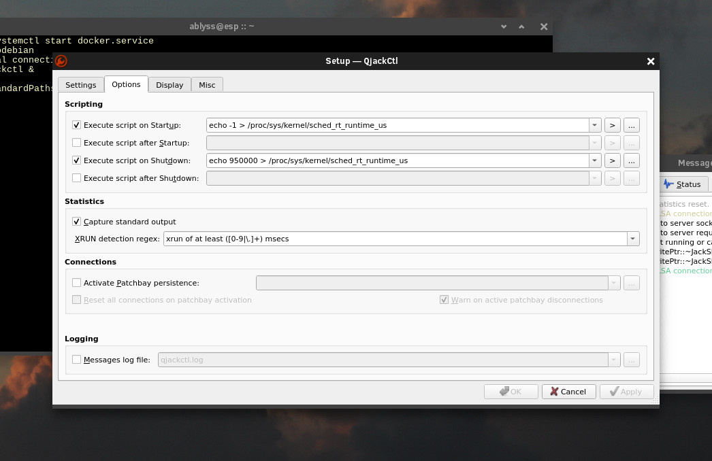

## Build docker container on Clear Linux and run Qjackctl in realtime - Command prompt installation.

```code
### Set xhost to accept connections from the docker container.

xhost local:${USER}

### Load module snd_seq.
sudo modprobe snd_seq 

### Install docker and pull docker image. 

sudo swupd bundle-add containers-basic

sudo systemctl start docker.service ## Have docker start at boot with systemctl enable docker.service

echo -e "FROM debian \\nRUN apt update \\nRUN apt upgrade -y\\nRUN apt update -y\\nRUN apt install qjackctl -y" > /tmp/Dockerfile

sudo docker build -t debianc1 < /tmp/Dockerfile -

sudo docker run -it --privileged  -e JACK_NO_AUDIO_RESERVATION=1 -v /dev/shm:/dev/shm:rw --net=host -e DISPLAY=${DISPLAY} debianc1

### Container Prompt.
qjackctl &

### After qjackctl starts, open the settings and set which audio card to use, framesize, samplerate, else it won't start.
### Add this line to the startup script in qjackctl. 
echo -1 > /proc/sys/kernel/sched_rt_runtime_us
### Add this line to the shutdown script in qjackctl. 
echo 950000 > /proc/sys/kernel/sched_rt_runtime_us
```

```code


### Close qjackctl, but DO NOT exit the container terminal without saving container first! See next step.

### Save the docker container - So we do not have to repeat all the steps again we need to save the docker container.
sudo docker ps

sudo docker commit \<CONTAINER ID\> debianc1 # Replace \<Container ID\> with the first ID shown after your type sudo docker ps


### This is a little bash function for .bashrc to save the container.

dodebiansave() {

var="$(sudo docker ps)"

var=($var)

sudo docker commit ${var[8]} debianc1

}

### This is a little bash function for .bashrc to start the container. 
### This includes directives for pulseaudio for running non-jack stuff in the container but not required.

dodebian() {

sudo modprobe snd-seq

xhost local:${USER}

sudo docker run -it --privileged -e JACK_NO_AUDIO_RESERVATION=1  --device /dev/snd -e PULSE_SERVER=unix:${XDG_RUNTIME_DIR}/pulse/native -v ${XDG_RUNTIME_DIR}/pulse/native:${XDG_RUNTIME_DIR}/pulse/native -v /dev/shm:/dev/shm:rw --net=host -e DISPLAY=${DISPLAY} debianc1

}


### Testing qjackctl in the docker container.
apt install lmms -y

qjackctl &

lmms --allowroot &
### Tell lmms to use jack, restart lmms and play a sample song.
### Save your container image as described above.

### Extra stuff you can add to the container are cairo-dock or lxpanel, jamin, rakarrack, guitarix, ardour, obs-studo, nvidia driver.


### Delete docker contianer - If you need to start fresh or delete the it.  I'd also do a docker system prune for a deep clean removal if need be.
sudo docker rmi debianc1 --force  \#(omit the first pound sign).
```


